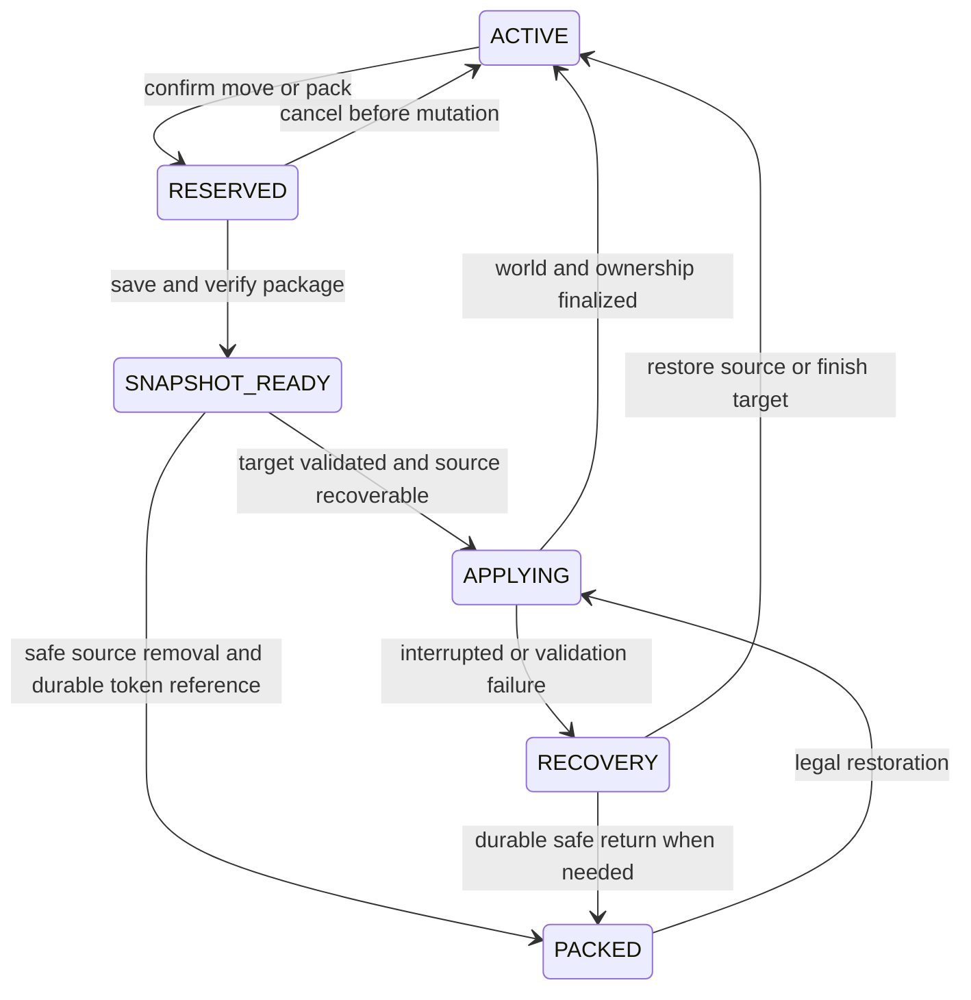

# Housing and guild specification

Current implementation update: [road centerlines, connected public-road anchors, house fitting and aurora boundaries](../implementation/housing-navigation-and-boundaries.md) supersede the older edge-distance and smoke recommendations below.

Status: proposed behavior. Rules explicitly requested by the owner are preserved; recommendations resolve ambiguities so implementation and tests have a concrete contract. Later guild clarifications take precedence over the earlier statement that member plots cannot be anchors.

## World and geometry model

The hub is a public service world. Personal and guild plots occupy a shared housing world. Public portals and public roads are server-owned infrastructure; adventure worlds provide activities and resources. A housing plot is a claim boundary, distinct from the house prefab placed inside it.

Claims reserve an X/Z footprint for the world's full supported vertical range, preventing stacked claims. Each world also declares allowed construction Y limits. Basements must fit those limits. Use footprint masks internally so more shapes can be introduced without rewriting claim rules; start with axis-aligned rectangles and quarter-turn rotation.

For rectangles, use half-open block bounds `[x, x + width)` and `[z, z + depth)`. Thus a 24 × 24 plot beginning at X=0 includes X=0 through 23. Convert the legacy inclusive bounds explicitly during migration.

**Recommended distance convention:** horizontal Euclidean distance between the outer faces of the two footprints, ignoring elevation. For rectangles, compute `dx = max(0, a.minX - b.maxX, b.minX - a.maxX)` and similarly for `dz`; distance is `sqrt(dx² + dz²)`. A footprint ending at X=24 and one beginning at X=29 have a five-block gap. Adjacent non-overlapping footprints have gap zero. For masks, use their actual occupied footprint boundary, not only the bounding rectangle. Use the same function for preview, commit, diagnostics, and tests.

“Within five blocks of a house” is measured from the neighboring **plot boundary**, and the neighbor must have an active main house. This proposed interpretation prevents moving a house within its plot from changing someone else's eligibility. The UI should say “near an established plot.” A token-only empty claim cannot expand the neighborhood.

### Plot sizes

| Owner | Free shapes | Paid shapes | Largest rectangular house bounds before roads or other obstructions |
| --- | --- | --- | --- |
| Player | 24 × 24 (576 blocks) | 32 × 32 (1,024 blocks) | 14 × 14 free; 22 × 22 paid |
| Guild | 48 × 48 or 36 × 64 (2,304 blocks) | 64 × 64 or 32 × 128 (4,096 blocks) | 38 × 38 / 26 × 54 free; 54 × 54 / 22 × 118 paid |

All dimensions are exact block counts. The five-block border setback removes ten blocks from each dimension for structures. A starter house must therefore fit within 14 × 14 on the free personal square. The guild rectangles are proposed same-area options; validate them against actual guild prefabs before locking the catalog. A future personal shape must have the same tier area and a useful eroded build area; area equality alone is insufficient.

## Default plot boundary fog

Use a short wall of wispy fog to show real personal and guild plot edges during normal play. It is **enabled by default and has no player toggle**. It follows the terrain, appears only when the viewer is close to a border, and its complete visible extent never rises more than **one block above the local ground**. It is visual only: no collision, damage, movement restriction or extra claim area.

Recommended initial tuning for local testing: full subtle visibility within three blocks of the nearest border segment, fading smoothly to zero by eight blocks; sparse pale limestone/sage wisps rising from about 0.05 to 0.7 blocks, with sprite/trail bounds constrained below the one-block ceiling. Distances, opacity and density are implementation tuning values, not player-facing settings. Keep the effect transparent enough to see paths, props and players through it.

- Compute boundary segments from actual plot footprints, including rotated rectangles/future supported masks. Measure distance to the **edge segment**, not distance to the filled footprint (which is zero everywhere inside it).
- Sample local ground along each edge. A highest-block heightmap can select tree canopies or roofs, so use bounded surface/collision sampling and cached terrain heights; skip unavailable chunks instead of loading a whole district for decoration.
- Deliver only to nearby same-world viewers at an appropriate elevation. A player deep in a basement or viewing a distant neighborhood should not see its surface fog. Render nearby portions of a border rather than its entire perimeter when only one corner is close.
- Leave public roads and portal arrival areas visually open: omit fog at protected corridor/clearance crossings. Deduplicate coincident adjacent plot edges to avoid a double-bright seam.
- Reuse effect state, update proximity at a bounded rate, and budget emitters/particles per viewer. Distance fading plus a small hysteresis band prevents flickering around the cutoff.
- Use finite system, spawner and particle lifetimes. Count emitter height, velocity, acceleration, sprite extent and scale animation in the one-block envelope; a particle culling sphere is not a physical height clamp.
- Refresh cached samples after terrain changes, moves/resizes, eviction commits and world reload. Stop emissions on travel, disconnect, unload or claim removal; existing wisps expire quickly at the former location.
- The temporary **red/green ground grid** remains the claim-placement validity preview. Existing `/eternia plots show` or other administrative wireframes are separate diagnostics and never toggle this default fog.

Hytale's local `ParticleUtil` source supports explicit per-viewer recipient lists; use that delivery path with no excluded source player, finite duration and ordinary distance/occlusion behavior. Implement a dedicated boundary effect instead of reusing the current 100-block-high, long-lived debug boxes. Aetherhaven's smokestack wisp is an animation reference only: its current upward motion/lifetime exceeds the required height. See [particle source evidence](codebase-audit.md#plot-boundary-particle-source-evidence).

Acceptance: verify inside/outside approaches, slopes/stairs, roads, corners, adjacent seams, sprinting across the fade distance, different camera angles, removal/relocation and reconnect. Measure visible height including full particle artwork, and particle/network cost with many neighboring claims. A debug outline or translucent solid wall does not fulfill this feature.

## Public road protection

Represent each public road as an explicit X/Z corridor mask, independent of the block material currently displaying the road. Every road column is protected through the full world height. A personal plot may overlap this mask, but that intersection grants no right to alter the road or its airspace. It still counts within the selected nominal plot area; the preview shows the reduced buildable area.

No player, house prefab, prop, tree, fence, basement, palette change, restoration job, or path tool may replace, clear, or place any cell in a public road column. Check the complete write set, including prefab air, foundations, foliage clearing, entities with block footprints, and terrain cleanup. A roof cannot overhang a road and a tunnel cannot pass below it. Server infrastructure maintenance uses a separate audited action.

Protect housing from indirect changes too: ordinary place/break, fluids, explosions, fire, growth, farming, entity interactions and other mod world-edit adapters must honor the housing policy. Isolate or disable incompatible mutation mechanisms in the housing world until they can be integrated. Visitors do not receive a way to bypass protection by using a tool instead of a normal block action.

House walls, roof overhangs, foundations, and additions must be at least five blocks from road boundaries. Props need to stay on permitted plot cells but do not inherit the house's five-block border setback: fences and trees can decorate the edge. Their full collision/occupied extent must fit; visual models with overhanging geometry need declared bounds. Paths may reach the plot edge and stop immediately beside a public road; they never repaint the public road.

## Claim eligibility

One personal housing slot is allowed per account and one guild root slot per guild. The slot remains occupied across active, packed, moving and restoring states; it is not freed by packing the property. Claim-token reissue while packed resumes that same property/relocation operation and cannot create another fresh claim. Claim tokens are account- or guild-bound handles to durable eligibility, not tradable deeds that can mint additional plots. The personal primary house must be player-owned. An upgraded size is an entitlement attached to the owner, not a special unrestricted placement tool.

All claims require the housing world, a loaded and valid build region, no overlap with other plots/reservations, a supported footprint, entitlement to the tier, and a usable area for a compatible house. Public portal footprints and their arrival-clearance reservations cannot be claimed; the explicit public-road easement is the allowed infrastructure overlap. Show road and setback exclusions before confirmation.

| Claim kind | Required anchor | Public road proximity | Who may use it as a new anchor? |
| --- | --- | --- | --- |
| Ordinary personal | Gap ≤ 5 to a public hub portal footprint **or** an established ordinary personal plot in a portal-reachable public component | Gap ≤ 5 to a public road corridor | Any eligible player once its main house is active and its public component is portal-reachable |
| Guild root | Portal gap ≤ 240, five members at first claim, valid public road connector proposal | Root can be away from current roads; the connector is part of commissioning the root | Current members of this guild once its house is active |
| Guild-attached personal | Gap ≤ 5 to this guild's active root **or** a connected, established member plot in this guild neighborhood | No public-road proximity requirement | Current members of this guild, only while connected to its active root |

Use explicit `PUBLIC`, `GUILD_ROOT`, and `GUILD_ATTACHED` claim modes. A member's ordinary public plot remains public and does not gain an eviction dependency just because its owner joined a guild. Switching an existing public plot to guild-attached mode requires a preview of changed anchoring/departure consequences and explicit confirmation.

A guild-attached plot never becomes a public anchor merely because its owner leaves or its grace period begins. No circular chain may establish a neighborhood without a guild root. Likewise, public components must reach an active public portal through valid five-block public edges; an isolated cycle of ordinary plots cannot validate itself. Store/recompute root reachability using the spatial index and membership revisions. Do not accept a cached UI validity result after another player moves, a role changes, or the source anchor disappears.

This protects the claimed neighborhood and denies outsiders expansion through it; it does not grant a guild ownership of all nearby unclaimed terrain. An outsider who satisfies ordinary public rules independently can claim legal unreserved space. Reserve only actual approved road corridors and claims, not an invisible unlimited guild buffer.

### Anchor loss after a valid claim

The request defines placement eligibility, not a general cascade of evictions. Recommended behavior:

- An ordinary plot remains owned if a neighbor later moves or a portal is removed, but cannot anchor further expansion until it is connected to a valid public anchor again. Do not force unrelated players to move.
- A guild member whose supporting neighbor leaves keeps their plot. Recompute all alternative same-guild edges. A disconnected component becomes `ANCHOR_SUSPENDED`: members keep access and builds, but it cannot anchor new claims until connected again.
- During the departing owner's 48-hour grace period, that plot cannot be used for new anchor edges. Existing downstream plots follow the suspension rule, without inheriting the departing player's eviction deadline.
- Root relocation cannot silently strand a neighborhood. Preview affected plots and connectors; require a reconnecting plan or an explicit recorded acknowledgement of anchor suspension. Never move member properties as an unannounced side effect of moving the guild root.

## Claiming a personal plot

1. The Housing NPC explains sizes, roads, anchors, and free content. “Get Plot Token” creates or reissues the player's single eligibility token.
2. Using it outside the housing world opens directions and travel; it cannot place there. In the housing world it opens Plot Selection.
3. Show size/shape, orientation, nearby roads/anchors, excluded road columns, legal structure inset, and a ground grid projected onto terrain. Green means currently valid; red means invalid. Include text and symbols so color is not the only cue.
4. Give movement/nudge/rotation controls and a Birds-eye toggle with pan and zoom scaled to the footprint, including 128-block guild rectangles. Keep the avatar safe and camera movement inside a bounded preview area.
5. Show all invalid reasons, such as “7 blocks from the nearest public road,” “requires a guild anchor,” “overlaps another plot,” or “no compatible starter-house area.” No button can override them.
6. “Place Plot” opens a second confirmation showing world/location, dimensions, claim mode, neighboring anchor, and credits/entitlements used. Clicking Confirm reserves and revalidates the location and ownership in one operation. If state changed, return to preview with a reason.
7. Finalize the claim and issue Housing Ledger access. Grant free starter content and the one-time free move credit through idempotent onboarding receipts. Losing the token or ledger allows reissue from the NPC without another grant.

Close/cancel, death, disconnect, world transfer and errors clear only this session's overlay and restore the camera. Preview itself never edits terrain or consumes a credit. Claim reservation has a short timeout and is released on cancellation; the committed claim does not expire just because the player is offline.

## Housing Ledger and tools

The Housing Ledger is a free management prop/menu inspired by Aetherhaven's planning desk and Eternia's management block. It is available immediately after claiming, even before a house exists, through the claim token/menu or NPC; it does not create a dependency on an already-placed building.

| Page/tool | Player actions |
| --- | --- |
| Overview | Current plot, house, safe spawn, privacy, road/anchor status, notices, relocation state |
| Housing Inventory | Browse owned/locked styles, props, additions, palettes and improvements; filter compatible content; see acquisition source |
| Token Workshop | Materialize owned content into placement tokens or craft explicitly configured recipes; no paid unlock is fabricated by a recipe |
| Building Tool | Select/preview/rotate/nudge/place a style; change style through a preservation/fit preview |
| Decoration Tool | Place, rotate, move and package authorized props; filter indoor/outdoor and size |
| Additions | View compatible sockets, preview porch/room/basement and affected decor, then confirm |
| Palette Tool | Select roof/wall/floor/trim slots; preview only tagged structural cells |
| Path Tool | Door/entrance to selected road-edge connection with a few control points, one width/style selector, preview and undo |
| Property | Move, pack, resize, set spawn/visitor entrance, manage pet slots; show consequences and cost before confirmation |
| Services | Open mailbox, shop management, pet collection and authorized travel destinations |

Keep player UI choices small; content belongs in catalogs. Staff get a prefab authoring tool for bounds, sockets, palette tags, service markers and validation. A regular player's tool never opens unrestricted world-edit operations.

### Content placement categories

- **House styles:** primary shells, with player/guild scope, fit bounds, safe spawn and management points. One main house per plot.
- **Props:** furniture, paintings, wall decor, counters, beds, rugs, trees, fountains, fences, statues, gazebos and lights. Interior/exterior are useful tags rather than separate ownership systems.
- **Additions:** porch, deck, side room and basement modules, attached to compatible sockets. They count toward structure setbacks and collision bounds. Basement themes can be treasure rooms or dungeons without adding combat behavior.
- **Finishes:** block palettes for roof, walls, floors and trim. Use semantic regions and compatibility rules; never blindly replace every matching block type throughout a plot.
- **Improvements:** styled paths and functional props such as mailbox/shop/teleporter. Separate their appearance from the capability entitlement.
- **Pets and pet items:** account pets assigned as follower or property resident; pet homes, toys and accessories are props or cosmetic attachments.

Changing styles preserves decor by local transform where compatible, previews conflicts and packs displaced items safely. Applying a palette changes only authored material slots still tracked as structure, preserving custom blocks. New houses/additions/palettes are content additions; a new kind of behavior may require a new handler.

Free building with ordinary blocks can be supported inside the claim through the same policy and ownership log. Treat unclassified player building blocks as structural for setbacks so hand-building cannot bypass the house rules. Explicitly authored decorative props and landscaping/path operations retain their own allowed border behavior. The first version must capture those edits before claiming full-property relocation support. Placement shortcuts, terrain edits and service props all use identical authorization.

## Moving, packing and resizing

Every player receives **one free voluntary plot-move credit once per account**. Further credits can come from a pass or store. A voluntary move of an active personal plot costs one credit only when the move succeeds. A canceled/failed attempt costs nothing. Missing-token reissue does not restore spent credits.

Packing an active plot voluntarily creates a pending paid relocation operation: reserve one move credit and consume it on successful re-placement. If no credit is available, the player cannot use packing/reclaiming to bypass the move cost. Reissuing that packed token refers to the same operation. A forced guild-departure/admin-repair return creates a **free restoration** token; its first legal placement costs no move credit. Replacing a house style inside the same plot does not move the plot.

Recommended launch treatment of guild-root movement: authorized leaders can request it with no credit charge because no guild move-price requirement was specified. It still requires connector validation, dependency-impact confirmation and complete recovery. Put future guild move pricing behind the same credit service without inventing a purchase now.

### Snapshot contents and custody

Capture a versioned, immutable property package containing:

- Footprint/orientation, house style/version, addition graph/sockets, palette selections, placed instances and their local transforms.
- Player-added and modified cells, exact block rotations and supported block state, furniture components, containers/items with full metadata, approved persistent entities, and interior/exterior decoration.
- Ownership per asset/item, historical grant and refundable-source references, property pets and accessories, service marker locations and safe spawn candidates. Snapshot grant references are audit data; restore checks the current authoritative entitlements and never resurrects expired/refunded rights from an old snapshot.
- References to mailbox/shop records and escrows. These inventories remain in their existing durable custody; do not duplicate them into a structure token or snapshot payload.
- A supported-component manifest, checksum, content versions and an inventory count for verification. Reject the operation before source removal if required state cannot be serialized.

Do not include players, visitors, stray mobs, public roads, server portals, or unrelated dropped entities. Guest-owned persistent objects require explicit placement permission and a recorded owner; return them to that owner rather than treating location as ownership. Preserve terrain-restoration data separately from the portable property. Exclude protected road columns from both capture-as-property and restoration writes.

Freeze affected builds/containers and suspend visits/listings during the operation. Reserve source and target regions; load all affected chunks. Save target terrain before applying. Keep staged destination content inaccessible and marked with the operation ID until the source cleanup and ownership commit are verified. Recovery must leave one authoritative active or packed property, not two usable copies. Release the old claim only after its restoration and final custody are durable.

A paid 32 × 32 entitlement does not automatically overwrite neighbors. Preview expansion around the current plot, then re-check overlap, roads, anchors and usable area. If it fits, resize in place without a move credit. If relocation is required, show the normal move-credit cost **before buying the upgrade**, as well as the choice to keep the entitlement unused until a legal location is found. Never promise reserved nearby land with a size upgrade.

## Guild formation and management

Guilds provide membership, a live roster, parties, a notice board, shared inventory and a shared house. Start with one guild per account, named ranks and action-level permissions. Five distinct authenticated member accounts are needed to obtain/activate a guild plot token; configurable server-side eligibility may change later. Members dropping below five after placement does not erase the plot or paid assets. A guild may own only one root and one main guild house across all housing worlds.

### Guild menu layout

Use a left navigation list and a main content pane. Keep dangerous actions on a separate confirmation screen showing the object and impact. This is an Eternia design; the [verified Darktale inspiration](integration-research.md#darktale-reference-verified-features-only) is custom ranks and action permissions, not an asserted copy of its exact screens.

| Page | Visible information and actions |
| --- | --- |
| Overview | Name/emblem, leader, member count, house status, today's online members, pinned notice, active parties |
| Members | Search, online/last seen, role, attached-plot badge, invite, inspect permissions, promote/demote/remove |
| Roles & Permissions | Create/rename/reorder role; category toggles; preview a member's effective permissions; save revision and audit diff |
| Parties | Create party, invite online member, see world/activity and available places, transfer lead/leave; ordinary travel restrictions still apply |
| House & Neighborhood | Root dimensions/style, map of attached plots and connectors, anchor health, pending departures, plot token/claim/move/resize actions |
| Build Inventory | Owned styles/props/additions/palettes, quantities, current placements and owners; deposit/donate, reserve for placement, retrieve to guild stock |
| Conveniences | Guild mailbox/shop access, owned teleport destinations, member access and status; show guild purchase eligibility |
| Board | Persistent announcements and short posts; pin/edit/delete for authorized roles; notify members of meaningful changes |
| Treasury & Trade | Earned-currency balance/history, deposits and authorized withdrawals, shared listing management and guild trade shortcuts |
| Audit | Membership/role edits, build operations, grants, withdrawals, moves, eviction and recovery receipts |
| Settings | Member visibility, role defaults, invite policy; leader transfer and disband with explicit impact confirmation |

### Initial roles and permission matrix

Seed five roles: **Leader**, **Officer**, **Architect**, **Quartermaster**, **Member**. The leader is unique and has all guild permissions; transfer leadership explicitly before leaving. Each member has one role initially. Permissions are allow-only, default deny, with no inheritance complexity in the first release. Custom roles edit the same named capabilities. Personal account permissions and server-admin powers are separate.

In this table L=Leader, O=Officer, A=Architect, Q=Quartermaster, M=Member. Unlisted roles lack the capability by default.

| Capability | Defaults | Boundary |
| --- | --- | --- |
| `guild.view`, `guild.chat`, `board.read`, `party.create` | L O A Q M | Current members only |
| `board.post` | L O A Q M | Author can edit own post; moderation separate |
| `board.moderate`, `member.invite`, `member.remove` | L O | Can act only on lower roles; cannot remove leader |
| `member.role.assign` | L O | Only lower roles; cannot assign capabilities the actor lacks |
| `role.edit`, `leadership.transfer`, `guild.disband` | L | Leader powers cannot be added to a custom role |
| `housing.claim`, `housing.move`, `housing.resize` | L | Root operations; separate from decorating |
| `housing.structure`, `housing.palette`, `housing.addition` | L A | Guild root or specifically authorized guild asset, not unrestricted personal plots |
| `housing.prop.place`, `housing.prop.move`, `housing.prop.pack` | L A | Guild-owned assets and permitted locations |
| `housing.block.build`, `housing.block.break` | L A | Guild build region; never public-road columns |
| `housing.road.manage` | L A | Approved guild-road corridors only |
| `inventory.deposit` | L O A Q M | Explicit donation confirmation transfers ownership |
| `inventory.reserve_for_build` | L A | Reserve/place without converting guild stock into personal inventory |
| `inventory.withdraw`, `shop.manage`, `mail.attachments.claim` | L Q | Audited transfers; withdrawal destination/ownership shown |
| `treasury.deposit` | L O A Q M | Earned currency only |
| `treasury.withdraw` | L Q | Confirm amount/destination, apply transaction atomically |
| `housing.door.use`, `housing.bed.use`, `housing.bench.use` | L O A Q M | Interaction scopes distinct from container withdrawal |
| `housing.container.open` | L Q | Opening and withdrawing may be separate checks where UI supports it |
| `convenience.use`, `housing.visit` | L O A Q M | Guild has entitlement and member is current at time of use |
| `commerce.purchase_for_guild` | L | Select guild as a purchase recipient; does not grant arbitrary withdrawal or provider administration |
| `audit.view` | L O Q | Private guild audit |

Role order alone must not grant escalation: validate both actor hierarchy and granted capability set, on every action and save. Re-check permissions after a menu opens and immediately before world mutation, item withdrawal, or travel. Placing or changing guild-owned assets on a member's personal plot also requires that owner's explicit plot permission; guild architecture access is not blanket access to private houses. Recovery jobs have narrowly scoped system authority to return recorded assets. No “guild admin” catch-all should be required for ordinary architects.

### Root placement and roads

The root plot can be within the proposed 240-block portal radius while away from current roads. During preview, the server proposes a bounded road corridor connecting the root entrance to the public road/portal network. Validate terrain, other plots and protected areas, reserve the corridor with the root, and let the player confirm the combined plan. If no legal route exists, reject that location with a reason.

Commission the connector before activating the root as an anchor. A simple initial implementation uses a few orthogonal control points and terrain grading within fixed limits; do not require a general road-generation engine. Admin-assisted connector review is a fallback for exceptional terrain, not a hidden requirement for every guild.

Guild architects may author community roads inside guild-owned plots or member plots with that owner's explicit road easement. Shared gaps require an approved corridor reservation, not unrestricted editing of wilderness. These roads have a protected mask and change via the road tool with affected-owner checks. The exemption is from **public-road proximity**, not the five-block structural setback or public road-column protection. Existing houses cannot be invalidated by laying a new guild road through them.

Guild houses use distinct guild-only styles and sockets. They share the same mail/shop/travel/pet handlers as personal houses, with larger visual options. A guild teleporter entitlement belongs to the guild: all current members may use it without owning a personal teleporter. Ex-members and public shop visitors may not use it.

## Guild departure and forced returns

This rule applies to a player's **guild-attached personal plot** when they leave or are removed from the guild. An ordinary public plot is unaffected. Guild membership permissions end immediately. At departure, persist `departedAt`, `reclaimAt = departedAt + 48 hours`, old guild ID and membership revision; send a system notice with the deadline and free-return explanation.

During grace, the player keeps access to their personal house and may move using an ordinary move credit, but cannot place/withdraw/use guild assets or provide new guild anchors. Prevent conversion to public mode during grace from bypassing the requested return; offer legal relocation instead. Rejoining the same guild strictly before the deadline cancels that departure job under the current membership revision. Joining a different guild does not cancel it. Serialize membership transitions and deadline eligibility on the same slot/job lock: at or after `reclaimAt`, return eligibility is latched even if the worker is delayed by downtime. A late rejoin does not cancel that due return merely by changing the membership revision. A later departure following a valid pre-deadline rejoin creates a new revision/deadline; an old canceled job cannot act on it.

At or after the deadline, even if the player is offline:

1. Lock the slot, job and membership revision; re-check current plot mode, owner, guild and deadline. If a valid pre-deadline cancellation or completed relocation superseded the job, complete it without action. A late rejoin is not such a cancellation.
2. Freeze edits and service access, move occupants to a safe location, and create a complete verified snapshot.
3. Partition contents by recorded owner. Player-owned house, additions, decor, ordinary placed blocks, containers/items and pets go to the player's recoverable property package. Guild-owned items and placements return to guild build inventory. Server infrastructure stays in place.
4. Container ownership does not automatically imply ownership of every item inside. Maintain custody/provenance through deposit and withdrawal. Explicit guild donations become guild-owned; private stored items stay player-owned. Foreign/guest-owned property returns to its recorded owner. Preserve per-owner quantities across identical-item stack merges/splits; if the native container adapter cannot preserve that custody ledger, prevent mixed-owner stacking in managed containers rather than guessing at eviction.
5. If returning a guild addition removes support for player decor (for example player furniture inside a guild-owned basement), retain the player's items as packed contents with original transforms and a fit warning. Never delete them or transfer the guild room to the player.
6. Restore allowed source terrain, remove the old claim, and finalize a bound **house/property token** referencing the packed snapshot. Deliver to the durable account inbox, independent of mailbox capacity or online inventory space. Guild returns use overflow-safe durable guild storage.
7. The player restores at a valid **ordinary public** location using the token without spending a move credit. Apply current size entitlements and road rules; preserve incompatible contents in storage instead of silently dropping them. A later explicitly authorized conversion can join a guild neighborhood.

Recompute affected anchor components and notify current members only of actionable disconnections. Persist the job, package, returns and operation receipts so a restart midway resumes exactly once. Count 48 real elapsed hours using UTC, not in-game time or online ticks. On restart, process overdue jobs in bounded batches; do not delete plots before their recovery package exists.

If a guild disbands, freeze new guild actions, schedule attached-personal returns with the same notice/grace, and preserve the root snapshot and guild assets in an archived guild estate. Default final custodian is the last leader for recovery, without converting bound guild purchases into personal entitlements. Show the disposition before confirming disband; later restoration requires an authorized guild recovery. Never silently destroy paid or member property when deleting a guild row.

## Required scenario checks

| Scenario | Expected result |
| --- | --- |
| Plot five blocks from both a road and eligible public anchor | Valid; at greater than five on either requirement invalid |
| Plot touching a road, house safely inset | Claim can be valid; every road column excluded from all construction |
| House 14 blocks wide on 24-block square | Fits exactly with five clear blocks each side, subject to roads and actual bounds |
| Basement or roof crosses a road column | Invalid at any height |
| Member B claims within five blocks of member A connected to its guild root, far from public roads | Valid guild-attached claim |
| Outsider uses the same A plot as their only anchor | Invalid |
| Member A leaves; member B has no alternate root connection | A gets a 48-hour return job; B keeps their plot but cannot anchor expansion |
| Departure job runs twice or server restarts after guild-item return | One packed property and one guild return per owned asset |
| Member rejoins at 47 hours; old deadline later fires | No eviction for that old membership revision |
| Member rejoins exactly at 48 hours or at 49 hours after worker downtime | The due return still completes once; current membership does not erase the expired deadline |
| Player has guild prop inside a private container room | Prop returns to guild; private items retain player ownership |
| Guild and player own identical items stored together | Returned quantities match the custody ledger through merge/split operations |
| Two confirmations claim the same space | One durable winner; loser retains token/credit and receives updated preview |
| Upgrade has no adjacent space | Entitlement retained; plot unchanged; relocation offered with disclosed move cost |
| Voluntary pack followed by fresh token reissue | Same relocation reservation, not another free move |
| Walk near an established personal/guild plot border without using any command | Wispy fog appears by default, fades with distance and never exceeds one block above local ground |
| Fog near slopes, adjacent seams, roads, distant viewers or a removed claim | Terrain-following bounded height, no doubled seam, open road crossings, and no stale/distant effect |
