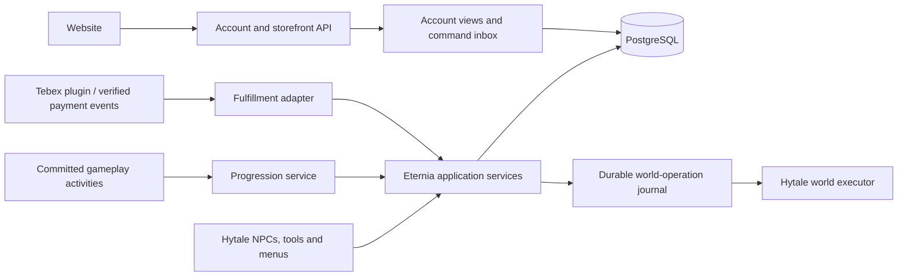
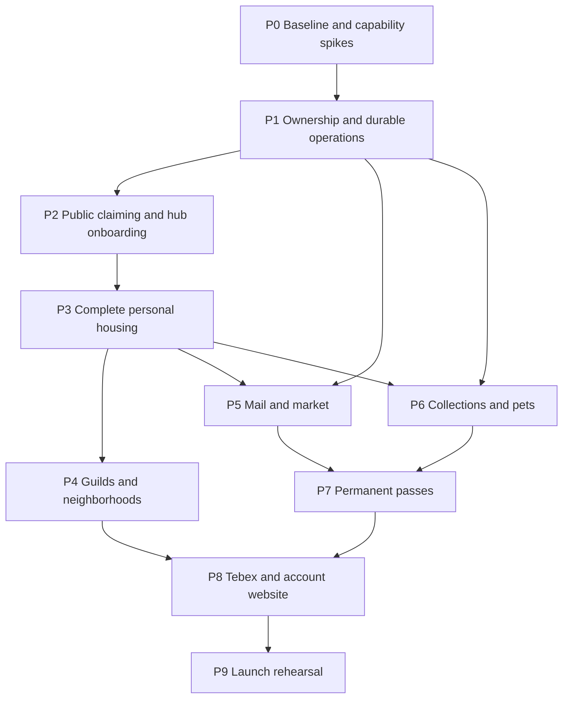

# Implementation roadmap

> Implementation update: server shutdown no longer runs `syncAssets`. Both `runServer` and `runServerNoSync` retain source resources. `syncAssets` is a manual import only; the original planning notes below describe the earlier behavior.

This document defines proposed implementation work. See [the overview](README.md) for product defaults and [the audit](codebase-audit.md) for inspected code. No runtime changes are part of this planning delivery.

## Architecture

Keep a modular Java plugin in the existing repository. Use a single authoritative server process initially; separate hub, housing, and adventure worlds by world role. Add a fresh `website/` application using Aetherhaven's JavaScript ES modules, Node, Express, npm lockfile, plain HTML/CSS/browser JS, and Railway/Nixpacks approach. It serves account sessions, checkout links and account views from one process/port. Reuse tools and setup patterns, with Eternia's own features and visual design. See [website stack and setup](website-stack.md).

The database transaction cannot atomically commit Hytale terrain or native inventory. Persist an operation intent, reserve the affected assets, apply the world/inventory change on the correct world thread, and record completion with an idempotency key. Recovery must inspect durable state and converge to one result. Use an outbox/inbox and persisted jobs in the same database; a message broker is unnecessary for the first server.

### Module responsibilities

All package names below are proposed under `com.hexvane.eterniamod`.

| Module | Owns | Extension boundary |
| --- | --- | --- |
| `account` | Stable Hytale UUID, onboarding, last session, preferences, account links | Account repositories; login provider |
| `catalog` | Versioned definitions, references, validation, availability | Typed JSON definitions and content handlers |
| `ownership` | Unlock grants, quantities, placed-asset provenance, delivery inbox | All free/token/pass/paid rewards use the same grant service |
| `housing` | Claims, anchors, road corridors, build policy, personal/guild plot lifecycle | Plot shapes, structure sockets, build categories |
| `placement` / `prefab` | Existing preview, camera, transformations and world operations | Shared placement-policy result; snapshot adapters |
| `guild` | Membership, roles, permissions, shared assets, departure jobs | Capability IDs and guild event handlers |
| `social` | Parties, presence, guild board and scoped communications | Activity invitations; notification channels |
| `travel` / `hub` | World roles, NPC actions, safe landing, home routing | Destinations and dialogue/action definitions |
| `economy` / `mail` / `market` | Earned-currency ledger, native-item escrow, mail, listings, checkout | Trade eligibility and delivery adapters |
| `collection` | Titles, full skins, wearable slots, follower and property pets | Render/follow adapters and content definitions |
| `progression` | Qualified activities, XP, objective state, reward claims | Event adapters, objective handlers, seasons |
| `commerce` | Tebex products, purchase lines, subscriptions and reconciliation | Purchase provider; entitlement mappings |
| `persistence` | Migrations, repositories, outbox, scheduled jobs, operation recovery | Schema-versioned storage, no public database writes |
| `admin` | Authoring tools, diagnostics, recovery, audit, content validation | Narrow commands using the same domain services |

Menus call application services. Services re-check account identity, ownership, world role, permissions, and current revision at commit time. A preview or hidden button grants no authority. Paid products grant content or capabilities through the same service used by free rewards.

Development runs locally by default: Hytale client/server, Node/Express, PostgreSQL and isolated account/payment fixtures. See [local development](local-development.md) for the target commands and limits of mocks. Apply the [Citadel theme](theme.md) and [shared tokens](theme-tokens.json) to both native UI and website; map the same design reference to their different rendering formats. The preview is a design prototype, not a live Hytale UI test.

### Persistent records and invariants

Use UUIDs for accounts, guilds, plots, placed instances, and operations. Use immutable namespaced IDs for content. Store world IDs independently of display names; timestamps use server UTC; coordinates include world and integer block bounds.

| Records | Invariant |
| --- | --- |
| Account, session, account link | Authenticated UUID is identity; username is display data. A browser never chooses its own game-account ownership |
| Catalog revision, entitlement grant, reward claim | Source grants are individually identifiable. A source cannot grant twice; one revoked source does not erase another valid source |
| Housing slot, plot, footprint, anchor edge, road corridor | One personal slot per account and one root slot per guild across active, packed, moving and restoring states. No claim overlaps another claim; road columns remain reserved |
| Placed instance, item/container provenance, property pet | Every asset has an owner principal (`PLAYER`, `GUILD`, or `SERVER`) distinct from the builder and current location |
| Guild, membership revision, role, departure job | Permission is scoped to the current guild and action. A departed member cannot use guild assets during the grace period |
| Snapshot manifest, blob, world operation | Snapshot immutable and hash-checked; no release of a source claim until recovery can prove destination or packed ownership is durable |
| Item escrow, mail, listing, trade, delivery | One item is in exactly one authoritative custody state. Full native item metadata is preserved |
| Currency ledger and balances | Integer amounts only; append transactions; reserve before settlement; no negative spendable balance |
| Season progress, objective state, reward receipt | A gameplay event is credited once; free and paid claims are independent unique receipts |
| Product mapping, payment line, subscription | Payment delivery is idempotent per provider line and quantity, with explicit subscription period and refund state |
| Outbox, inbox, scheduled job, audit entry | Retryable work survives restart; logs identify actor, reason, affected IDs, and result |

Store compact searchable metadata in PostgreSQL and versioned large plot snapshots in managed blob files with hashes and a retention policy. Back up database and referenced blobs as one recoverable set. Do not put a whole plot snapshot inside an item stack.

## Delivery sequence

Each phase produces a playable, reviewable slice with small seed content. A phase is complete only when its acceptance gate passes. Integration discovery can run alongside core work; gameplay-dependent phases follow the arrows below.

### P0 — Establish a tested baseline and resolve external capabilities

- Inventory existing assets and data; build against a pinned Hytale build and pin the currently floating Gradle plugin version to the tested version.
- Establish isolated local game worlds, local PostgreSQL and a local website shell with deterministic accounts/payment fixtures. Production startup must reject test identity providers. Implement the shared Citadel token mapping and one native GUI/website component sample before extending screens.
- Record build/test results using the Java 25 toolchain. There is currently JUnit configuration but no checked-in test tree; do not confuse that with test coverage.
- Reproduce building and prop preview, camera toggle, placement, pickup, entity handling, and reconnect cleanup in a disposable world.
- Spike native inventory escrow and a full decorated-property snapshot, including container state, entities, rotation, and rollback after interruption. Mark unsupported serializable entities explicitly.
- Confirm green/red ground-grid delivery and camera restoration on close, disconnect, world change, death, and shutdown.
- Prototype viewer-local wispy border fog with a one-block maximum visible height, terrain sampling and distance fading. Measure particle/network cost before choosing its final density.
- Verify Prowl assets and animation dependencies. Demonstrate a stationary greeter and one dialogue action.
- Verify Tebex command identity/acknowledgement, full-skin rendering and wearable slots on the exact supported client/server pair. Inspect Aetherhaven's OAuth code and design the game-UUID mapping now; use the local identity harness until a supported callback and new OAuth application are available. Real sign-in can be tested early locally when supported; the production origin is checked in P8. See [research](integration-research.md).

Acceptance: reproducible baseline instructions, identified supported/unsupported snapshot components, a tested recovery strategy, and explicit feasibility results. Unsupported custom wearables delay their storefront listing; they do not delay ordinary housing work.

### P1 — Build the shared ownership and persistence foundation

- Add typed catalog envelopes, content reference validation, account identity, entitlements, provenance, integer currency ledger, durable delivery inbox, job runner, and audit records.
- Introduce repositories and schema migrations. Create a single placement authorization service and a chunk-based spatial index for plots and roads.
- Refactor building/prop commits and packaging so credits and instances are reserved before mutation and finalized only with a recoverable result.
- Add world-operation journal and snapshot adapters. Keep world mutations on the world executor; do not block its tick on database or file I/O.
- Introduce read-only world mode if authoritative storage is unavailable: no purchases, claims, transfers, or destructive edits while writes cannot be made durable.
- Make lost-token reissue retrieve a durable grant or packed property, rather than minting another claim, asset or move allowance.

Acceptance: duplicate/replayed grants and concurrent commits cannot duplicate assets; restart recovery handles every transition of an interrupted place, package, or delivery. A creator can register a second ordinary prop without adding Java code.

### P2 — Open public claiming and the hub

- Configure world roles and author one hub area, a small road network, and enough public portals for the test housing district.
- Add authoritative road-column masks, portal anchors, claim geometry, collision checks, five-block proximity, setbacks, and one-plot eligibility.
- Build the free plot token flow: NPC grant → housing-world preview → colored ground grid and reasons → optional birds-eye controls → confirmation → claim.
- Add default-on proximity fog along established plot edges. It has no player toggle, stays within one block of local ground, leaves road/portal crossings open and uses bounded per-viewer rendering. Keep the placement grid and administrative wireframes separate; guild roots use the same effect when implemented in P4.
- Add all six hub NPCs and the world-select portal. Housing and greeter flows work end to end; later services show a clear unavailable/coming-soon state until their phase completes. Use shared Citadel navigation, buttons, status colors and icon styles in every native menu.
- Grant a starter style, essential tools, one free mailbox entitlement, Housing Ledger access, and exactly one free voluntary move credit.
- Add admin portal/road authoring and plot diagnostics; existing admin assignment commands must pass the new invariants or use an explicit audited override.

Acceptance: two concurrent claims for the same space yield one winner, protected roads cannot be edited by any build path, preview and confirmation agree, and canceled placement consumes nothing. Nearby borders show wispy fog automatically; distant viewers receive no visible effect, and every wisp stays below the one-block ground-relative ceiling.

### P3 — Complete personal housing

- Adapt the existing placement menus into Housing Inventory: styles, palettes, props, additions, improvements, and property pets.
- Implement socket-based additions (one porch and one basement), semantic material palettes, a constrained path tool, and full vertical bounds.
- Preserve the five-block setback for the whole house including additions. Show a clear fit result before applying a style, palette, upgrade, or new plot size.
- Implement whole-property move/pack/restore, source terrain restoration, ownership filtering, destination revalidation, and upgrade-to-32 × 32 workflow.
- Add house spawn markers, strict more-than-30-minute home login routing, privacy/visitor rules, mail interaction hooks, and public shop entrance markers.
- Add personal teleporter capability and validated hub/world destinations; grant it through a test entitlement until paid fulfillment is ready.

Acceptance: a decorated occupied plot with modified blocks, containers, an approved persistent-entity fixture, and a basement survives move, rotation, crash, and restore without duplication or loss. Add the real property-pet relocation regression in P6 once pets exist. Public roads survive underground and overhead edits. A fresh login and short reconnect route correctly.

### P4 — Guilds, shared housing, and neighborhoods

- Add guild creation, invites, membership, roles, permission editor, roster/presence, parties, and a small persistent guild notice board.
- Implement five-member eligibility, the four guild footprints, one guild house, distinct guild structure/addition compatibility, and shared build inventory.
- Build guild-root road connection proposals and member-only anchor graph, with guild-managed community roads.
- Implement membership-revision checks, the 48-hour departure job, packed player-property returns, guild-asset returns, and disconnected-neighborhood recovery.
- Add guild mail/trading entry points and permissions for activation in P5, and member-only convenience use with test entitlements until P8 fulfillment.
- Add guild-root move/disband impact preview, ownership transfer, and permission/audit pages.

Acceptance: an outsider cannot claim from a guild anchor; a member can extend a connected member chain away from public roads; kicked/left members lose guild capabilities immediately and recover only their property after 48 hours. Server downtime and rejoining cannot produce duplicate eviction or asset delivery.

### P5 — Mail and player trading

- Implement private offline messages, item attachments, non-destructive capacity handling, claim-all, returns, notifications, and a hub mailbox fallback.
- Implement earned-currency sources through qualified activities and the shared ledger. Keep premium currency out of player trading.
- Add seller listing creation with stock escrow, search/filter at the hub, house visits, offline seller checkout, delisting, and proceeds delivery.
- Add direct trades usable by guild members and other players: reserve both offers and require both confirmations. A change invalidates both confirmations.
- Update house movement/removal to suspend visits and listings safely, then restore them using plot IDs rather than saved coordinates.

Acceptance: two buyers racing for the last item cannot both receive it; full inventories and offline sellers are handled without loss; restart between payment and delivery completes one sale. Trades and mail retain metadata and cannot trade bound entitlements.

### P6 — Collections and cosmetic pets

- Add collection UI, independently equipped prefix/suffix titles, one supported full-skin example, one supported wearable example, and restore-original-appearance behavior.
- Implement one follower pet per player, multiple owned pets assigned to a plot, placement of one pet home prop, lifecycle cleanup, and world eligibility.
- Keep pets decorative: no combat, loot pickup, harvesting, collision blocking, or pass XP. Set practical per-plot and per-world entity budgets.
- Add an accessory attachment handler with one sample to prove pet customization. Optional follow-up: pet feeding, play and care animations, with no neglect penalty or economic output.

Acceptance: appearance and pet ownership survive reconnect, whole-property relocation and transfer; two sessions cannot spawn duplicate followers; visitors cannot take a property pet; unsupported render assets fail validation before sale.

### P7 — Permanent season passes and activity quests

- Implement normalized qualifying gameplay events, distinct kill/mine/harvest credit rules, progress persistence, and one active season.
- Add permanent free/paid tracks, XP thresholds, reward receipt ledger, archived-season selection, paid upgrades that unlock already-earned tiers, and catch-up quests.
- Provide kill-count, item-count acquisition, and distinct-resource objectives, plus extension points for minigames and optional Aetherhaven activities.
- Seed one small test pass that proves reward types and late purchase. Author a production season only after XP telemetry establishes the five-hour target.
- Add content-based availability and compensation for disabled activities so an old season never becomes impossible to finish.

Acceptance: event retries, canceled block breaks, self-placed blocks, inventory shuffling, pet kills, and replayed claim clicks do not farm XP or duplicate rewards. Archived passes continue progressing after new ones appear.

### P8 — Tebex and the account website

- Map a small set of products to durable entitlement grants: plot upgrades, one decoration/style/addition/palette, personal/guild teleporters, titles, supported cosmetics, pets, move credits, paid season track, and one monthly supporter rank.
- Implement pending/delivered/reversed states, idempotent line delivery, subscription renewal/expiry, reconciliation, and non-destructive refund handling.
- Complete the Node/Express website locally using the shared Citadel theme, database and integration fixtures. Once a supported callback URL is ready, the owner creates a separate Hytale OAuth Client Application; test actual sign-in locally when the provider permits it. Then stage on Railway to verify deployment parity and the registered production/staging origin. See [the setup sequence](website-stack.md).
- Add Hytale OAuth login, dashboard, owned-content view, rank/expiry, pass progress, stats, store categories, and checkout/purchase status. Display immutable UUID-linked identity during checkout.
- Use Tebex-hosted checkout first. Payment completion in a browser never grants game content.
- Provide typed reward/currency hooks for future premium currency. Future implementation adds wallet purchase, spend, ledger, and pass reward behavior together; do not ship a partly spendable wallet.

Acceptance: real test-mode payment or provider-approved sandbox flow → correct account grant; retries and quantity purchases work; offline buyer receives items later; subscription expiry removes only time-limited benefits. Browser users cannot read another account's private mail or change its balance.

### P9 — Launch rehearsal and operator handoff

- Migrate a copy of existing Eternia plot data, validate it, and run a restore drill using database plus snapshot backups.
- Complete scenario-based checks across claims, road protection, guild departure, trade, pass, and purchase recovery. Exercise each multi-step operation with injected interruption after its durable transitions.
- Measure tick time, snapshot memory/I/O, housing-world entity load, preview network volume, search latency, and backlog drain at the expected player count. Establish limits using measurements rather than invented MMO capacity claims.
- Finalize content-validation tooling and the [authoring guide](content-authoring.md) against the actual formats, remove outdated proposed examples, and add operator recovery instructions.
- Stage paid products only after delivery and reconciliation pass. Use the specified Railway deployment during the website implementation task; this planning task does not create a website, OAuth application or store.

Acceptance: a new player can greet → claim → build → receive mail → list/buy → join a guild → progress a pass → receive a test purchase; restart and restore rehearsals preserve ownership throughout.

## Existing-data migration

1. Take a read-only inventory and a consistent backup of per-world plot JSON, prefabs, deployed content definitions, and terrain. Freeze build/trade mutations during cutover.
2. Import stable plot IDs, owner UUIDs, building/prop definitions and transforms into the new schema. Generate deterministic migration receipts so repeating the import does not duplicate assets.
3. Legacy records lack complete asset provenance and full snapshots. Assign identifiable plot-owned assets to the recorded player, flag ambiguous ownership for admin review, and quarantine unsupported state; do not infer ownership from whoever last placed a block.
4. Capture a verified current-state snapshot before enabling new destructive operations. Legacy terrain history may be incomplete: show that limitation and require a reviewed restoration baseline before moving a legacy plot.
5. Existing placements may violate new road/setback rules. Preserve them in a read-only legacy state with free corrective relocation, rather than silently shrinking or deleting them. Claims excluded from new anchoring remain excluded until validated.
6. Run dry-run counts, geometry checks, missing-content checks, and ownership totals; compare to imported records. Enable the new authority once, keeping original data immutable.
7. Roll back only before new writes, or restore/reconcile both world and database to the same checkpoint. Never point old JSON code at terrain already changed under the new system.

## Validation strategy

Use deterministic local tests for geometry, anchor reachability, role/capability delegation, grant/claim uniqueness, balances, membership deadlines, and season XP. Use local repository/integration tests for concurrency, persisted jobs, and recovery. Use the actual local Hytale client/server for camera, placement, entity serialization, native inventory, skins, and transitions. Use local browser checks for theme, responsiveness, keyboard behavior and account flows. A screenshot of a preview is not proof of a durable transaction. Railway staging verifies actual deployment, origin/cookies, connectivity and provider behavior after these local checks pass.

When implementation begins, use the existing Gradle test and release-jar verification tasks plus the new content-validation task. These are planned checks, not tests run for this documentation delivery. The current server run task syncs build resources back into source; use the existing `runServerNoSync` when testing source-authored assets.

## Feature coverage

| Requested capability | Primary phase | Detailed contract |
| --- | --- | --- |
| Prowl greeter; trading, personal/guild housing, store and coming-soon NPCs; world portal | P2, integrated by P8 | Player systems: hub and travel |
| Free/paid plots, shapes, roads, portals, anchors, grid, camera, confirmation | P2–P4 | Housing: geometry and claim rules |
| Default-on nearby wispy boundary fog, at most one block high | P0 spike, P2 implementation | Housing: default plot boundary fog |
| One free move credit; full-property moves; packed forced returns | P1, P3–P4 | Housing: lifecycle and snapshot custody |
| Tools, Housing Ledger, style, palette, props, additions, basement, paths | P3 | Housing: authoring and build rules; content guide |
| Free/world token/pass/paid acquisition | P1, P7–P8 | Player systems: ownership and rewards |
| Home login after 30 minutes; mail; house shops; paid travel | P3, P5, P8 | Player systems: travel, mail and market |
| Guild creation, online roster, parties, board, shared trade | P4–P5 | Housing: guild management; player systems: social |
| Guild sizes, unique styles/additions, private convenience, permissions | P4, P8 | Housing: guild rules and capability matrix |
| 48-hour member departure and owner-correct asset returns | P1, P4 | Housing: departure state machine |
| Tebex housing, cosmetics, paired titles, pets, monthly rank | P6, P8 | Player systems: collections and commerce |
| One follower, roaming property pets, pet home; optional care | P6 / follow-up | Player systems: pets |
| Permanent free/paid seasons, XP, catch-up, activity quests, future premium currency | P7–P8 / future wallet | Player systems: progression |
| Account website, Hytale identity, purchases, stats and rank | P8 | Player systems: website; integration research |
| Easy content additions and maintenance docs | P1 through P9 | Content authoring guide |
| Local testing preference, fixtures and final provider parity | P0 through P9 | Local development guide |
| Matching medieval vector-style GUIs and website | P0 foundations, all UI phases | Shared Citadel theme and design tokens |
